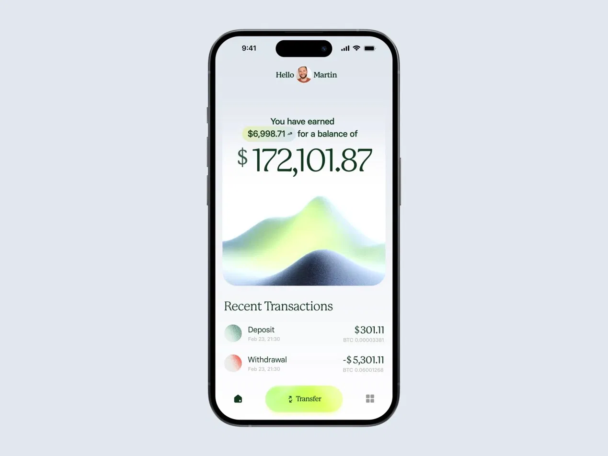
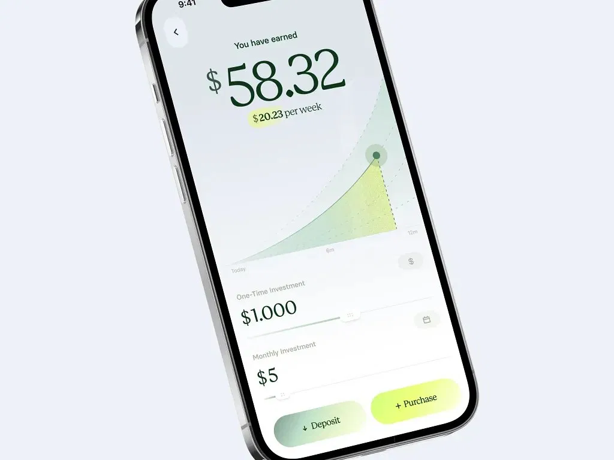
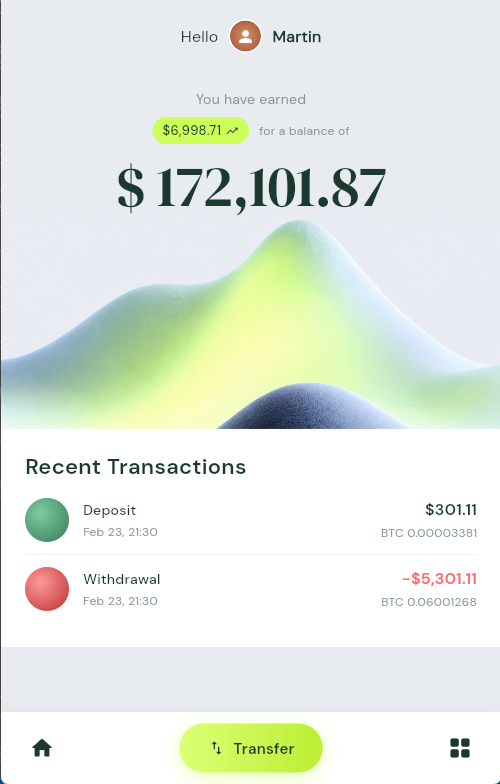
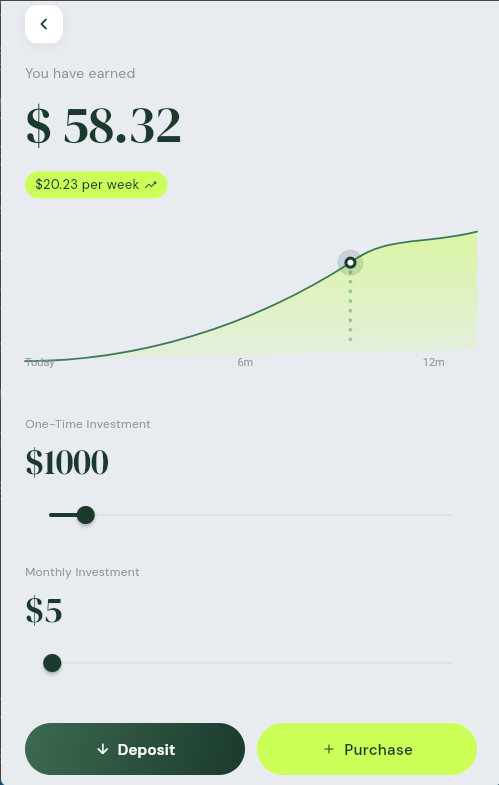

# Next Crypto App — Reproduction Flutter (Maquette Dribbble)

## Infos

- **Nom :** Tossou Elidje Emmanuel
- **Niveau :** L2 Génie Logiciel

---

## C'est quoi ce projet ?

Pour ce TP, on devait choisir une maquette sur Dribbble et la reproduire en Flutter en essayant de rester le plus fidèle possible au design de base (couleurs, polices, espacement, icônes, etc.).

J'ai choisi une interface de suivi de cryptomonnaies qui s'appelle **Next Crypto App**. L'application contient **deux écrans** et j'ai essayé d'organiser mon code proprement avec des widgets réutilisables.

---

## Maquette originale

**Lien Dribbble :**  
https://dribbble.com/shots/27241033-Next-Crypto-App-Design

### Aperçu de la maquette




---

## Ce que j'ai obtenu

### Écran 1



### Écran 2



---

## Ce qui a été fait

- Reproduction de l'interface Dribbble (le plus fidèlement possible)
- Navigation entre les deux écrans
- Widgets personnalisés et réutilisables
- Interface responsive testée sur Chrome
- Couleurs et styles centralisés dans `constants.dart`
- Google Fonts utilisé pour la typo

---

## Structure du projet

```text
lib/
├── main.dart            # point d'entrée de l'app
├── constants.dart       # couleurs + styles
├── wave_painter.dart    # dessin de la vague et du graphique
├── widgets.dart         # composants réutilisables
├── home_screen.dart     # écran d'accueil
└── detail_screen.dart   # écran d'investissement
```

---

## Technologies

- Flutter
- Dart
- Google Fonts

---

## Difficultés rencontrées

Voilà les trucs qui m'ont pris le plus de temps :

- **Le responsive** : adapter tous les éléments à différentes tailles d'écran c'était pas évident au début.
- **L'organisation du code** : séparer les widgets correctement pour que ce soit lisible et réutilisable, ça demande un peu de réflexion.
- **La vague** : reproduire l'illustration en forme de vague sur la maquette était compliqué. Après plusieurs essais avec `CustomPainter`, j'ai finalement opté pour une image générée que j'ai utilisée en fond. Mais même avec l'image j'ai eu certains problèmes à cause du dossier assets.

---

## Responsive

J'ai testé l'application sur l'émulateur Chrome avec différentes dimensions. Les éléments s'adaptent correctement.

---

## Comment lancer le projet

1. Cloner le dépôt :

```bash
git clone <url-du-depot>
```

2. Installer les dépendances :

```bash
flutter pub get
```

3. Lancer :

```bash
flutter run
```

---
